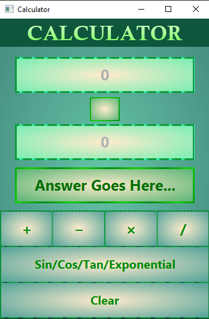
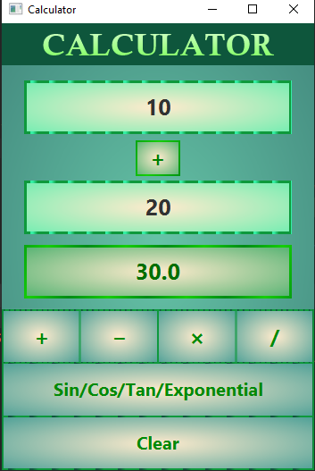
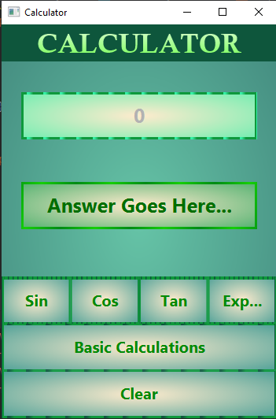
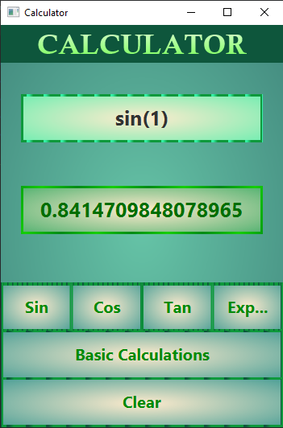
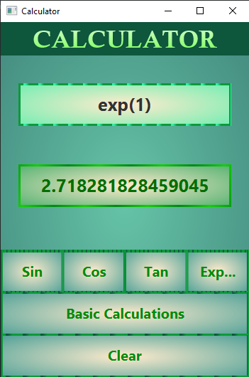

# RAD Calculator (Mini Calculator)

This is a mini calculator using JavaFx. It consist with two windows for basic calculations and Extra calculations.
 
Basic calculations
- - Addition
- - Subtration
- - Multification
- - Division
  
Extra calculations
- - Sine
- - Cosine
- - Tangent
- - Exponential

## Screen Shots

    
    
    
    
    

